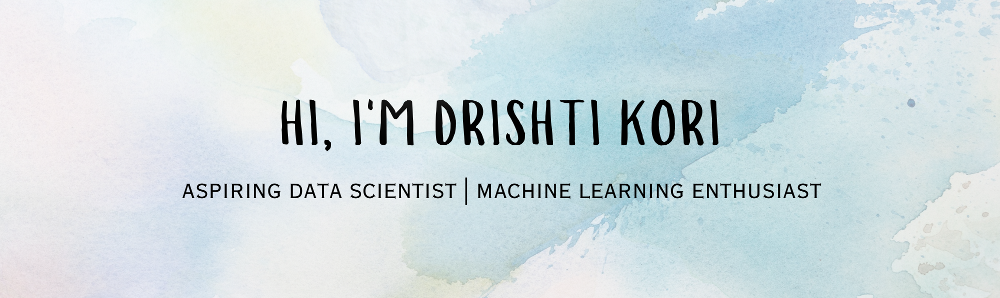

  

  

Data Science and Generative AI–certified BCA graduate (CGPA 8.07) skilled in Python, SQL, Machine
Learning. Experienced in data analysis, predictive modeling, and generating actionable insights
through hands-on projects. Completed an intensive Data Science Master’s Program with end-to-end
exposure to the data science workflow. Seeking an opportunity in Data Science or Analytics to apply and
grow my skills in a data-driven environment.  

  

🎯 Currently looking for: Data Science Internship / Junior Data Scientist roles

## Skills

Python • SQL • Machine Learning • Pandas • NumPy • Scikit-learn
Tableau • Matplotlib • Seaborn • Git • Jupyter Notebook

## Featured Projects

### Healthcare Recommendation System

Machine learning system that predicts health risk levels and generates personalized health recommendations.

Tech: Python, Pandas, Scikit-learn

### Instagram Fake Account Detection

Classification model to detect fake Instagram accounts using profile and engagement features.

Tech: Python, Machine Learning, Feature Engineering

### Climate Change Sentiment Analysis

NLP model analyzing sentiment in climate change discussions using TF-IDF and machine learning.

Tech: Python, NLP, Scikit-learn

### Tobacco Mortality Forecasting

Predictive model forecasting smoking-related mortality trends using historical healthcare data.

Tech: Python, Machine Learning, Data Analysis

## Connect With Me

LinkedIn: [www.linkedin.com/in/drishti-kori](http://www.linkedin.com/in/drishti-kori)  

Email: [drishtikori4@gmail.com](mailto:drishtikori4@gmail.com)
